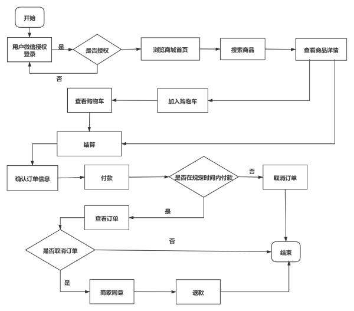

# gomall购物平台

gomall购物平台是一套电商系统，包括前台商城系统及后台管理系统，后端基于
SpringBoot+MyBatis-plus实现，前端基于vue框架和微信小程序ui框架实现。前台商城
系统包括首页、商品推荐、商品搜索、商品展示、购物车、订单流程、客户服务、帮助
中心等模块。后台管理系统包含商品管理、订单管理、促销管理、内容管理、消息管
理、账户管理等模块。

总体业务需求流程图：

